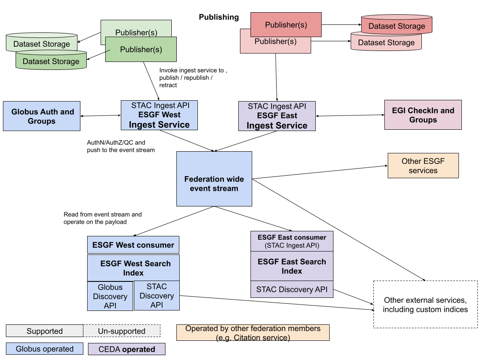

# Core Architecture for the Next Generation Earth System Grid Federation

## Introduction
This proposal provides an overview of the new Core Architecture for ESGF. ESGF is the key hardware and software infrastructure for distributing the climate and Earth system model simulation output that underpins the United Nations’ Intergovernmental Panel on Climate Change (IPCC) Assessment Reports, which are produced every five to seven years.[1]

The existing architecture for ESGF is in need of an update, so laboratories across the Department of Energy and the United Kingdom (CEDA) are teaming together to propose a more modernized approach.

## ESGF2 Architecture
The ESGF2 system architecture needs to continue to address requirements for scalability (to large quantities of data and many data sites and users), reliability (e.g., fault tolerance), extensibility (e.g., to new data types and data analysis methods), usability, and synchronization.[2]. With this in mind, ESGF2 Architecture will leverage highly available resources in the cloud consisting of several components.

### Identity and Access Management
ESGF will use federated authentication with trusted OAuth and OIDC standards. Globus Authentication and Authorization will be used for the West service and EGI Checkin will be the trusted authentication broker in the East. Globus and EGI Checkin groups will be checked to make sure a user has the authorization to perform a particular task.

### Publisher
The Publisher is responsible for sending events and payloads to the Ingest API. When new datasets are available, datasets are revoked, or there is an update to a dataset, the Publisher’s job is to send a well-formatted message (most likely in JSON format) to the Ingest API.

#### Publication Actions and Events
For all events, the Publisher will send the following to Ingest:
- Authorization
- Information about the origin of the event (provenance)
- The event type itself: one of publish, revoke, or update.
- A timestamp when the event occurred.

##### Publish Event
When new datasets are available, the Publisher will also send metadata describing the datasets to the Ingest API as STAC compliant items.

##### Revoke Event
The datasets’ metadata could remain in the index and be marked as “Revoked” or the entry can be removed from the index entirely. The data provider will make the decision of whether or not to purge the actual files.

##### Update Event (I am not 100% sure about this one)
When updated information is available for datasets, previous versions should be marked as deprecated and a new version should be added to the index.

### ESGF Ingest API
The Ingest Service allows authorized users in the federation to publish and manage metadata in the federation managed indices. The service is an authorized producer to the ESGF event stream service, and publishes an event to the federation wide event stream. Globus and EGI Checkin will manage access to their respective Ingest APIs.

### Federated Event Stream API
Federation wide event stream to manage a distributed index and replication of data with potential to extend its use for other cases. The Event Service will utilize a well-known event driven architecture set up in AWS Kafka. With Kafka as the broker, the Stream will produce events to be consumed by the East and West Consumer APIs. AWS Identity and Access Management tools will be used to manage access to the AWS Kafka cluster and any other tooling that is necessary.

### Consumer API
The Consumer API handles events passed from the Federated Event Stream that are received upstream from the Publisher and the Ingest API. The events are described above in the Publisher portion of this document. New dataset information is ingested as a STAC item into a Globus Search index.

## Architecture Diagram

>*Figure 1: The ESGF Core Architecture will consist of microservices that work together with a Federated Event Stream to replicate data and Publish, Retract, and Update metadata records for ESGF.*

# References
> [1] Forrest M. Hoffman, Ryan Prout, Dustin Leverman (ORNL), Ian Foster (ANL), and Sasha Ames (LLNL). August 30, 2022. Hierarchical Data Storage and Earth System Model Analytics Platform for the Next Generation Earth System Grid Federation (ESGF)
>
> [2] Forrest M. Hoffman. July 30, 2021. A Proposal from a Multi-Laboratory Consortium to Construct and Operate the Next Generation Large Scale Federated Data Enterprise for the US Department of Energy’s Earth and Environmental Systems Sciences Division.
