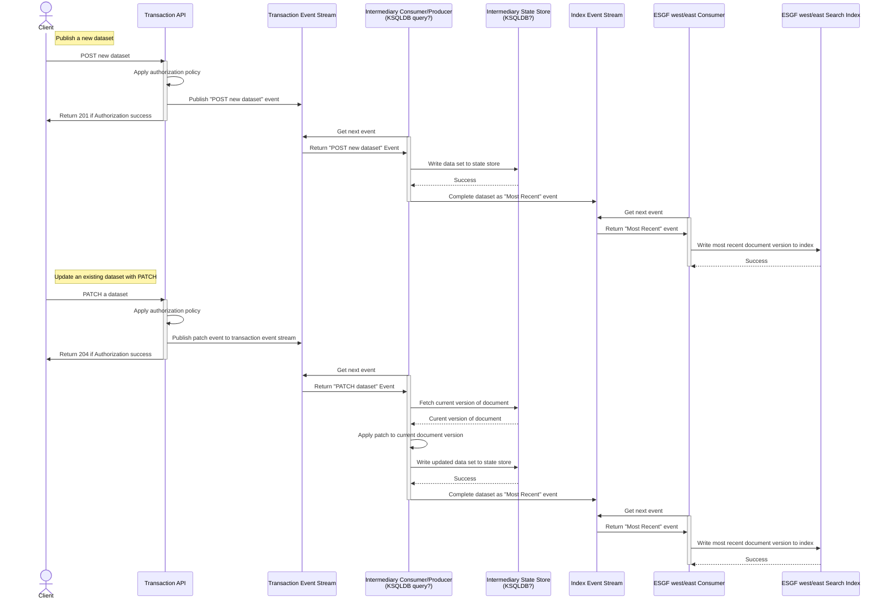
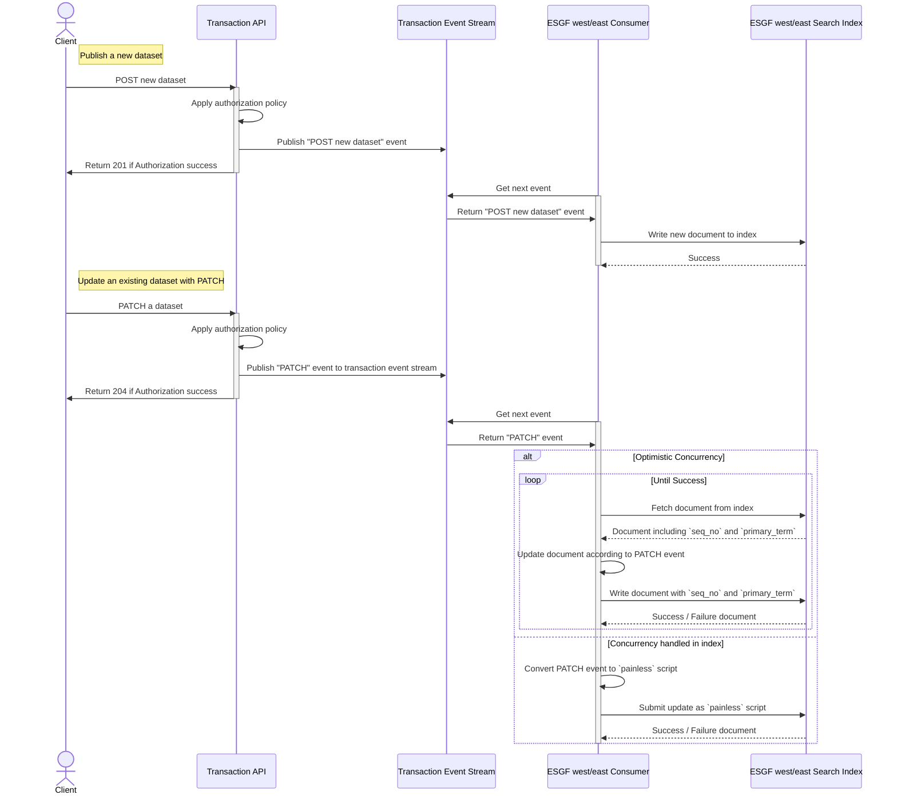

# Motivation

The ESGF [Publications Actions](https://github.com/ESGF/esgf-roadmap/blob/main/core_architecture/publication_actions.md#update-published-data-set) includes update operations on existing data sets.  Of particular interest is the [Replica Added](https://github.com/ESGF/esgf-roadmap/blob/main/core_architecture/publication_actions.md#replica-added) and [Replica Removed](https://github.com/ESGF/esgf-roadmap/blob/main/core_architecture/publication_actions.md#replica-removed) actions as both appear to involve updating a data set's metadata by specifying a delta against an existing published data set's metadata, as opposed to [Update published data set](https://github.com/ESGF/esgf-roadmap/blob/main/core_architecture/publication_actions.md#update-published-data-set) that involves publishing a complete new data set metadata document that will replace the previous one.  We assume that replica add and remove actions are specified as deltas against a published document since currently the only mechanism available in the [STAC Transaction API](https://github.com/stac-api-extensions/transaction?tab=readme-ov-file#patch) to update `alternate` assets is an [RFC7386](https://tools.ietf.org/html/rfc7386) [PATCH](https://github.com/stac-api-extensions/transaction?tab=readme-ov-file#patch). To apply a PATCH to a document in a distributed system we must choose some source(s) of truth (or state) against which that delta will be applied and think about how to resolve discrepancies if the update must be applied to multiple sources of truth in different parts of the system.  It has also been proposed that [RFC6902](https://datatracker.ietf.org/doc/html/rfc6902) PATCH be support, though that doesn't materially change the challenges addressed in this document.

It is worth noting that changing the  model for how replicas are added, removed, and represented in indices could provide some partial solutions to the challenges as well and may be worth considering.  While we won't go into detail on this in this document, one such approach may be to store PATCH events (or maybe even just a subset of them such as replica add/remove) in a separate index along side the original STAC document, and then leave it to the STAC Discovery API to resolve those updates against the document in the primary index at query time. 

There are multiple ways to design a system that can resolve partial updates, we'll outline two here that we think we have reasonable paths to implement and discuss some of the trade offs made with each design.

# State stored in the event stream

In this approach, the ["Federation wide event stream"](https://github.com/ESGF/esgf-roadmap/blob/main/core_architecture/diagrams/architecture_design_dark.drawio.png) becomes more than a simple event stream by adding some store of state and logic to it that can resolve update events such that the output of the event stream is a sequence of complete STAC documents to be written into the indices.  To do this, we'll split the Federation wide event stream into 4 subcomponents:

1. **Transaction Event Stream**:  This will be an "input" event stream that stores Transaction API requests and appropriate metadata in a format similar or identical to what was submitted to the transaction API.  POST and PUT requests will result in the full STAC document being written to the Transaction Event Stream, and PATCH requests will result in a document containing only the changes being written to the Transaction Event Stream.
2. **Intermediary State Store**:  This will be a data store that stores fully realized STAC documents in a "materialized view".  This store will be considered the source of truth against which PATCH requests are applied.  There are several options for technology on which this could be built, though likely candidates would be [KSQLDB](https://ksqldb.io/) (integrates well with the kafka ecosystem) or [DynamoDB](https://aws.amazon.com/dynamodb/) (integrates well with AWS ecosystem).
3. **Intermediary Consumer/Producer**: This will be a consumer and producer that reads events from the Transaction Event Stream, resolves PATCHES against the Intermediary State Store, and writes complete STAC documents to the Index Event Stream.  There are several option for technology choice for this component, but likely candidates would be [KSQLDB](https://ksqldb.io/) (integrates well with the kafka ecosystem) or [Lambda](https://aws.amazon.com/lambda/)(integrates well with AWS ecosystem).
4. **Index Event Stream**: This will be an event stream read by the indexing "ESGF west/east Consumer" that will contain a sequence of complete STAC documents with updates applied that can be written directly to the respective "ESGF west/east Search Index".   The events on this stream can be interpreted as just a sequence of "Most Recent" versions of the document to be indexed.

One note on this design:  While at first glance it may appear that we are introducing a new concurrency challenge where the **Intermediary Consumer/Producer** may be processing multiple events for the same document in parallel, this should be able to be easily avoided by choosing an appropriate key for events that ensures sequential processing of all events for a given document.

Below is a sequence diagram of how this might work in practice along the "happy path" where a new dataset is published and then a patch is issued against it.  

## Error Handling

While this diagram presents the "happy path", we have not diagrammed error cases, though we expect later versions of this document to include such diagrams.  Below are three error cases we believe it is critical to address with potential implications on design:

- **Failed PATCH**: If a "PATCH" can not be applied (e.g. add a replica that already exists, remove a replica that doesn't exist, add replica to deleted dataset), what should the resultant behavior be?  Does anything need to be communicated to the client?  If so that implies potentially having the Transaction API block until the Intermediary Consumer/Producer can apply the patch.
- **Re-POST**: The current spec for the [POST method of the transaction api](https://github.com/stac-api-extensions/transaction?tab=readme-ov-file#post) says that it must "return 409 if an item exists for the same collection and id field values".  To support this, this also potentially involves blocking until the Intermediary Consumer/Producer can query the Intermediary State Store.  Alternatively, we deviate from spec and treat re-POST as a PUT.
- **Failed PUT**: The current spec for the [PUT method of the transaction api](https://github.com/stac-api-extensions/transaction?tab=readme-ov-file#post) says that it must "return 404 no Item exists for this resource URI".  To support this, this also potentially involves blocking until the Intermediary Consumer/Producer can query the Intermediary State Store.  Alternatively, we deviate from spec and treat failed PUT as POST.

## Pros and Cons
### Pros
- **Simplified "ESGF west/east Consumer"**:  One of the biggest implications of this design is that the consumers that write to indices can be greatly simplified.  They only need to handle a single kind of event, and they do not need to manage PATCH requests to their respective indexes.  They can simply take the latest versions of documents off of the event stream and overwrite any existing version in the index.
- **Full "materialized view"**: There will be a single materialized view that can be used to seed other indices in the future, and potentially be used for disaster recovery in the event of a catastrophic loss of an index.
- **Single source of truth**: Updates will be executed against a central "source of truth" meaning that there is less opportunity for drift to occur between indices in the case of missed updates or differences in logic between consumer implementations.
- **Error handling nearer API**: The three error cases outlined [above](#error-handling) could be resolved "closer" to the transaction API by either adding another "return" event stream and implementing an RPC style interaction between the API and the event stream, or by potentially giving the API direct access to the Intermediary State Store.
### Cons
- **Significant additional operation complexity for the Event Stream**: This design moves quite a bit of logic into the event stream.  This makes both development and operation of that component more complex.  More moving pieces means additional points of failure and more monitoring and ongoing maintenance.
- **Single point of failure**:  This design makes the **Intermediary State Store** mission critical, and good disaster recover mechanisms should be in place to support recovery of that state store within RTO/RPO.
# State stored in the indices

In this approach, all PATCH and update events are resolved against the current version in the respective west/east index.  

Below is a sequence diagram of how this might work in practice along the "happy path" where a new dataset is published and then a patch is issued against it.  For interactions between the ESGF west/east Consumer and the ESGF west/east Search Index, we included two alternate interactions depending on how we want to handle concurrency issues there.  Trade offs will be discussed below.

## Index Concurrency

One issue worth discussing in this design is how we resolve concurrent updates to the index for the same document.  We assume the indices are backed by Elastic Search here.  Elastic search supports two modes of resolving conflicting concurrent updates:  [Scripted Document Updates](https://www.elastic.co/guide/en/elasticsearch/reference/current/docs-update.html) and [Optimistic Concurrency Control](https://www.elastic.co/guide/en/elasticsearch/reference/current/optimistic-concurrency-control.html)  
### Optimistic Concurrency Control
Because Elastic Search is a distributed database, it does not support atomic update operations in general.  Instead, it relies on document version parameters (`seq_no` and `primary_term`) to identify a unique version of a document and implements Optimistic Concurrency Control.  Clients may provide both `seq_no` and `primary_term` when re-indexing a document and ES will fail the re-index if there is currently a newer version indexed.  Because ESGF west will likely be backed by Globus Search, this will probably be the simpler concurrency mechanism to implement.
### Scripted Updates
Scripted updates allow you to write a script that is executed against a document in the index.  The script is executed by ElasticSearch, and therefore reduces the risk of read before write conflicts.  However, as their documentation [points out](https://www.elastic.co/guide/en/elasticsearch/guide/master/partial-updates.html#_updates_and_conflicts) there is still some risk, so internally ES uses Optimistic Concurrency Control to prevent corrupting data.  Clients may provide a `retry_on_conflict` parameter to offload retries to ES, otherwise the consumer will still need to implement retries itself.  Because the client can offload some of this retry logic to ES, ESGF east may prefer this approach.
## Error Handling

Similarly to the state in event stream architecture, this diagram presents the "happy path", and we have not diagrammed error cases.  Below are a few error cases we believe it is critical to address with potential implications on design:

- **Failed PATCH**: If a "PATCH" can not be applied (e.g. add a replica that already exists, remove a replica that doesn't exist, add replica to deleted dataset), what should the resultant behavior be?  Does anything need to be communicated to the client?  If so, does the client needs to wait for the document to be indexed.  This has implications for how fast the update to the index needs to happen.
- **Re-POST**: The current spec for the [POST method of the transaction api](https://github.com/stac-api-extensions/transaction?tab=readme-ov-file#post) says that it must "return 409 if an item exists for the same collection and id field values".  To support this, we could rely on the transaction API querying the index, but without some concurrency control that introduces potential race conditions.  Alternatively, we deviate from spec and treat re-POST as a PUT.
- **Failed PUT**: The current spec for the [PUT method of the transaction api](https://github.com/stac-api-extensions/transaction?tab=readme-ov-file#post) says that it must "return 404 if no Item exists for this resource URI".  To support this, we could rely on the transaction API querying the index, but without some concurrency control that introduces potential race conditions.  Alternatively, we deviate from spec and treat failed PUT as POST.
## Pros and Cons
### Pros
- **Simplified Event Stream**:  One of the biggest implications of this design is that operational cost and development of the event stream is significantly reduced.  Fewer moving parts and less need for ongoing maintenance result in cost and development time savings. 
- **Fewer Single Points of Failure**: With the exception of the Transaction Event Stream, there are no single points of failure.  Additionally, the the Transaction Event Stream does not need to store a complete copy of the indexed documents, the potential impact of it failing and return to operational time are reduced.
### Cons
- **Complexity in consumer and index**: This design moves quite a bit of logic into the consumer including retry / concurrency control logic, and translation of PATCH to appropriate update scripts.
- **Error handling far from API**: The three error cases outlined [above](#error-handling) can't be fulling resolved until the document exists in the index.  This implies more opportunities for conflicts as well as potentially requirements for faster indexing.
